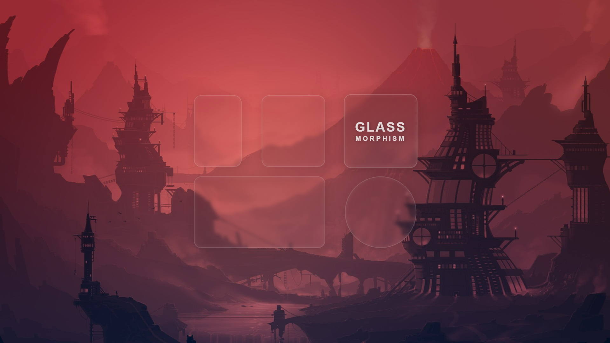
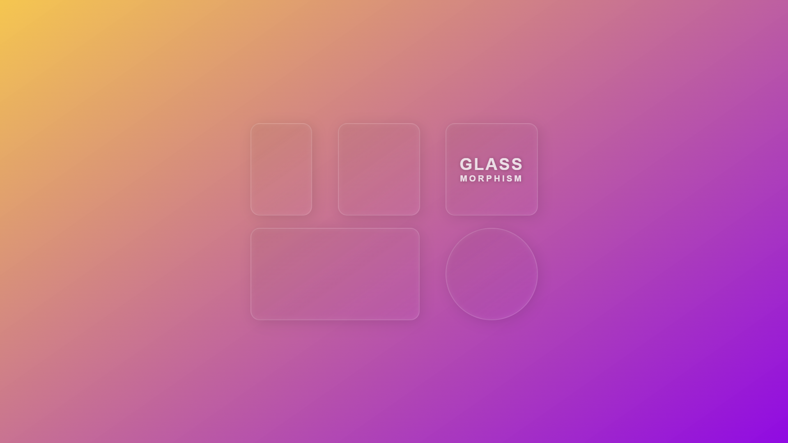
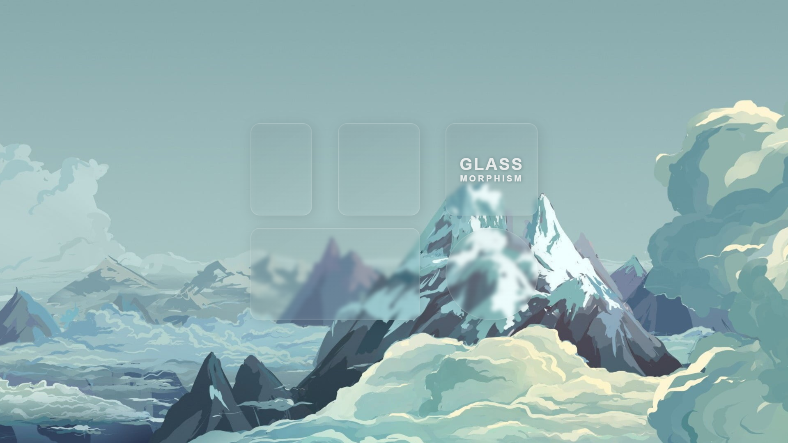
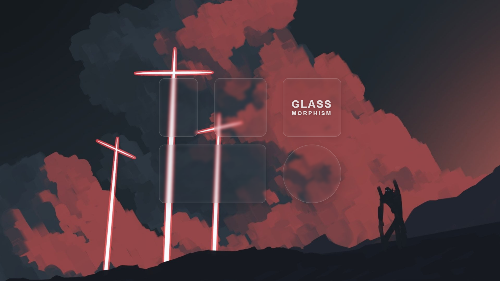

# glassmorphism
 <h2>🪟 Exemplo de uso do efeito Glassmorphism em elementos da página. </h2>

 - <a href="https://filipemartins-dev.github.io/glassmorphism/">🔗 Entrar na página</a>

 <h3> Background 01 </h3>
 
  

 <h3> Background 02 </h3>
 
  

 <h3> Background 03 </h3>
 
  

 <h3> Background 04 </h3>
 
